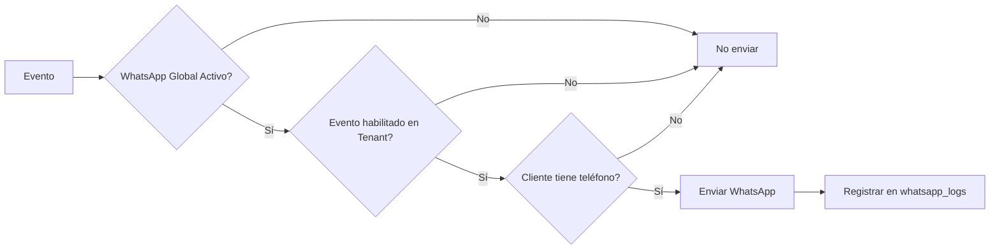

# 📘 Manual de Usuario – Sistema de Puntos
**Versión:** 1.4 • **Fecha:** 06/11/2025

---

## 📑 Índice
1. [Tipos de Acceso](#1-tipos-de-acceso)
2. [Panel SuperAdmin](#2-panel-superadmin)
3. [Panel del Comercio (Tenant)](#3-panel-del-comercio-tenant)
4. [Roles y Permisos](#4-roles-y-permisos)
5. [Integración Webhook](#5-integración-webhook)
6. [Notificaciones Automáticas](#6-notificaciones-automáticas)
7. [Cupones PDF y Reimpresión](#7-cupones-pdf-y-reimpresión)
8. [Portal Público](#8-portal-público-de-autoconsulta)
9. [Comandos de Mantenimiento](#9-comandos-de-mantenimiento)
10. [Preguntas Frecuentes](#10-preguntas-frecuentes)

---

## 1. Tipos de Acceso

| Rol | URL | Base de datos | Credenciales iniciales |
|-----|-----|----------------|------------------------|
| **SuperAdmin** | `/superadmin/login` | `users` (MySQL) | `superadmin@puntos.local / superadmin123` |
| **Comercio (tenant)** | `/{RUT}/login` | `usuarios` (SQLite tenant) | Usuarios auto-generados al crear tenant |

- El **SuperAdmin** administra la plataforma, crea/suspende tenants y configura servicios globales.
- Cada **comercio (tenant)** tiene su propio panel con usuarios y datos aislados.

---

## 2. Panel SuperAdmin (`/superadmin`)

### 2.1 Dashboard Global
- **Métricas principales:** Tenants totales/activos, facturas procesadas, puntos generados.
- **Ranking:** Tenants con mayor actividad.
- **Auditoría:** Últimas acciones registradas en `admin_logs`.

### 2.2 Configuración Global

#### 📧 Email SMTP
- **Campos:** Servidor, puerto, usuario, contraseña, cifrado (ninguno/TLS/SSL), remitente.
- **Prueba:** Botón "Enviar email de prueba" abre modal para validar configuración.
- **Uso:** Envío de reportes diarios automáticos a los tenants.

#### 📱 WhatsApp
- **Campos:** URL del servicio, token de autenticación, código país (default: +598).
- **Switch:** Habilitar/deshabilitar servicio global.
- **Prueba:** Botón "Enviar WhatsApp de prueba" abre modal para probar envío.
- **Nota:** Esta configuración aplica a todos los tenants. Cada tenant decide qué eventos enviar.

### 2.3 Gestión de Tenants
- **Crear tenant:** Ingresa RUT, nombre comercial, email y teléfono de contacto.
  - Al guardar se crea automáticamente el archivo SQLite y se generan usuarios iniciales.
  - Se muestra un resumen con las credenciales generadas (documentar para el cliente).
- **Editar:** Cambiar estado (`activo`, `suspendido`, `eliminado`), actualizar datos de contacto.
- **Acciones rápidas:**
  - 🔑 Regenerar API Key (webhook)
  - 👥 Regenerar usuarios iniciales
  - ⏸️ Suspender/activar tenant

### 2.4 Webhook Inbox Global
- Tabla con todos los webhooks recibidos (tenant, estado, HTTP status, timestamp).
- Payload JSON expandible para análisis detallado.
- Filtros por tenant y estado.

---

## 3. Panel del Comercio (Tenant) (`/{rut}`)

### 3.1 Acceso y Navegación
- **Login:** Acepta usuario o email + contraseña.
- **Sidebar:** Responsive con botón hamburguesa en móvil.
- **Módulos visibles según rol:** Admin ve todo, Supervisor ve operaciones, Operario solo consulta.

### 3.2 Dashboard del Comercio
- **Métricas en tiempo real:**
  - Total de clientes
  - Puntos generados/canjeados del mes
  - Facturas procesadas
  - Puntos en circulación
- **Listados:**
  - Clientes recientes
  - Actividad reciente del tenant

### 3.3 Gestión de Clientes
- **Búsqueda:** Por documento o nombre.
- **Filtros:** Todos, con puntos, activos.
- **Paginación:** 10 resultados por página.
- **Detalle del cliente:**
  - Perfil (nombre, documento, contacto)
  - Puntos disponibles
  - Facturas activas (con fecha de vencimiento)
  - Historial de canjes
  - Puntos vencidos
- **Ajustes manuales (Admin/Supervisor):** Botón "Ajustar puntos" para sumar o restar con motivo obligatorio. El sistema registra el ajuste en el historial, notifica al log de actividades y no permite dejar saldos negativos.
- **Edición (Admin/Supervisor):** Nombre, email, teléfono, dirección.

### 3.4 Canje de Puntos (Admin/Supervisor)

#### Flujo de canje:
1. **Buscar cliente** por documento.
2. **Revisar información:**
   - Puntos disponibles totales
   - Facturas asociadas (tabla FIFO con monto y fecha de vencimiento)
3. **Seleccionar cantidad:**
   - Botones rápidos: 25%, 50%, 75%, 100%
   - Campo manual para cantidad exacta
4. **Confirmar canje:**
   - Se descuentan puntos siguiendo orden FIFO (primero vencen los más antiguos)
   - Se registra en `puntos_canjeados`
   - Se genera cupón digital con código único
   - **Notificación automática por WhatsApp** (si está habilitado)

### 3.5 Promociones (Admin)

#### Tipos de promoción:
- **Bonificación:** Suma puntos extra en porcentaje.
- **Multiplicador:** Multiplica los puntos generados (ej. x2, x3).

#### Campos:
- Nombre y descripción
- Valor (porcentaje, puntos fijos o multiplicador)
- Fechas de inicio y fin
- Prioridad (si hay múltiples promociones activas)
- Condiciones (JSON): monto mínimo, categorías, días de la semana
- Estado: activa/inactiva

#### Aplicación automática:
- El sistema aplica la promoción de mayor prioridad que cumpla condiciones.
- Se registra en cada factura qué promoción se aplicó.
- Botón "Notificar clientes": Envía la promoción activa por WhatsApp de forma manual a todos los clientes con teléfono.

### 3.6 Reportes y Exportación CSV

#### Reportes disponibles:
- **Clientes:** Listado con puntos, última actividad.
- **Facturas:** Historial completo con montos, puntos generados, promociones.
- **Canjes:** Detalle de todos los canjes realizados.
- **Actividades:** Log de acciones en el tenant.

#### Características:
- Filtros por fechas, estado, usuario (según reporte).
- Exportación CSV con codificación UTF-8 BOM.
- Nombres descriptivos: `clientes_YYYYMMDD_HHMMSS.csv`.

### 3.7 Gestión de Usuarios (Admin)

#### Roles disponibles:
- **Admin:** Acceso completo.
- **Supervisor:** Canjes, clientes, reportes.
- **Operario:** Solo consulta de clientes y puntos.

#### Operaciones:
- Crear/editar usuarios
- Resetear contraseña
- Activar/desactivar usuarios
- Ver último acceso

### 3.8 Configuración del Tenant (Admin)

#### Pestaña: Puntos

**Conversión de Puntos:**
- Define cuántos pesos equivalen a 1 punto.
- Ejemplo: Si pones 100, cada $100 de compra = 1 punto.
- Default: 100.

**Vencimiento de Puntos:**
- Días antes de que los puntos caduquen.
- Default: 180 días (6 meses).

**Reglas de Acumulación:**
- **Switch "Excluir e-Facturas":** Cuando está activo, las e-Facturas (CFE 111/112/113) se registran pero **no acumulan puntos**.
  - Se marca como `estado=omitido` y `motivo=excluir_efacturas`.
- **Notas de crédito** (CFE 102 y 112) siempre **restan puntos** (puntos negativos), independientemente de esta regla.

**Configuración de Moneda:**
- **Moneda base:** UYU, ARS, USD, etc.
- **Tasa USD → base:** Ejemplo: 1 USD = 41 UYU.
- **Monedas desconocidas:**
  - "Omitir (no acumula)" - Facturas en monedas sin tasa configurada no generan puntos.
  - "Procesar sin convertir" - Se usa el monto tal cual (para comercios que operan en múltiples monedas sin conversión).

#### Pestaña: Datos de Contacto
- Nombre comercial
- Teléfono
- Dirección
- Email

**Estos datos aparecen:**
- En el portal público de autoconsulta.
- En las notificaciones WhatsApp enviadas a los clientes.

#### Pestaña: Notificaciones (WhatsApp)

**Eventos disponibles** (switches individuales):

| Evento | Descripción | Cuándo se dispara |
|--------|-------------|-------------------|
| **Puntos Canjeados** | Notifica al cliente cuando canjea puntos | Al completar un canje |
| **Puntos por Vencer** | Avisa cuando hay puntos próximos a vencer | Automático diario vía comando `tenant:tareas-diarias` |
| **Bienvenida Nuevos** | Mensaje de bienvenida al registrarse | Al crear cliente desde webhook |
| **Promociones Activas** | Notifica sobre promociones vigentes | Manual (no implementado aún) |

**Requisitos:**
- WhatsApp debe estar habilitado globalmente (SuperAdmin).
- El cliente debe tener número de teléfono configurado.
- El evento debe estar activado en esta pestaña.

#### Pestaña: Mantenimiento **[NUEVO]**

**Compactar Base de Datos:**
- Elimina facturas procesadas con más de **12 meses** de antigüedad.
- Elimina registros huérfanos en `webhook_inbox`.
- Ejecuta `VACUUM` para reducir el tamaño del archivo SQLite.
- **Los puntos acumulados en los clientes permanecen intactos.**

**Estadísticas mostradas:**
- Total de facturas actuales
- Facturas antiguas (>12 meses) que serán eliminadas
- Tamaño aproximado de la base de datos

**Precaución:**
- Operación irreversible.
- Se recomienda realizar respaldo antes de compactar.
- Doble confirmación de seguridad.

### 3.9 Campañas (Admin)

- **Tipos de envío:** WhatsApp, Email o Ambos.
- **Estados:** borrador → pendiente → en proceso → completada.
- **Fuentes de clientes:** todos los clientes activos, listas segmentadas (próximamente).

**Flujo de trabajo:**
1. Crear campaña (título, mensaje, canal, programación).
2. Revisar resumen de destinatarios y confirmar.
3. Ejecutar “Enviar ahora” o programar para una fecha/hora.
4. El sistema genera un envío (`campana_envios`) por cliente y los coloca en la cola `campanas`.
5. El cron `queue:work --max-jobs=30` procesa lotes de mensajes cada 15 minutos.

**Límites y buenas prácticas:**
- WhatsApp: la cola espera 2 segundos entre mensajes para evitar bloqueos del proveedor.
- Email propio (SMTP del tenant): límite automático de **50 correos diarios**. Al superarlo, los envíos restantes se reintentan el día siguiente.
- Email global (servicio premium): sin límites diarios.

**Monitoreo:**
- Desde el detalle de la campaña se ve el avance (enviados, fallidos, pendientes).
- El historial guarda el origen del envío (`panel`, `api`, `ajuste`) para auditoría.

---

## 4. Roles y Permisos (Tenant)

| Módulo | Admin | Supervisor | Operario |
|--------|-------|------------|----------|
| Dashboard | ✅ | ✅ | ✅ |
| Clientes (consulta) | ✅ | ✅ | ✅ |
| Clientes (editar) | ✅ | ✅ | ❌ |
| Canje de Puntos | ✅ | ✅ | ❌ |
| Promociones | ✅ | ❌ | ❌ |
| Usuarios | ✅ | ❌ | ❌ |
| Configuración | ✅ | ❌ | ❌ |
| Reportes | ✅ | ✅ | ✅ |

---

## 5. Integración Webhook

### 5.1 Endpoint
```
POST https://tudominio.com/api/webhook/ingest
```

### 5.2 Autenticación
```
Authorization: Bearer {API_KEY_DEL_TENANT}
```

- La API Key se genera automáticamente al crear el tenant.
- Se puede regenerar desde el panel SuperAdmin.

### 5.3 Formato JSON Esperado
El sistema acepta el formato estándar de e-Factura (Uruguay):

```json
{
  "CfeId": 101,
  "Numero": 12345,
  "FecEmis": "2025-10-04",
  "Client": {
    "NroDoc": "12345678",
    "RznSoc": "Juan Pérez",
    "NroTel": "098123456",
    "Email": "cliente@example.com"
  },
  "Total": {
    "TotMntTotal": 1500.00,
    "TpoMoneda": "UYU"
  },
  "Emisor": {
    "RUT": "000000000016"
  }
}
```

### 5.4 Flujo de Procesamiento
1. Se valida la API Key (Bearer token).
2. Se identifica el tenant por la API Key.
3. Se registra el webhook en `webhook_inbox_global`.
4. Se adapta el JSON al formato estándar interno.
5. Se procesa la factura:
   - Se crea/actualiza el cliente
   - Se calcula el monto en moneda base (si aplica conversión)
   - Se aplican reglas de acumulación (excluir e-facturas, etc.)
   - Se aplican promociones activas
   - Se generan puntos y se acumulan en el cliente
   - **Se envía notificación de bienvenida** si es cliente nuevo y está habilitado
6. Se registra en `webhook_inbox` del tenant.

### 5.5 Tipos de CFE Soportados
| CFE | Nombre | Comportamiento |
|-----|--------|----------------|
| 101 | e-Ticket | Acumula puntos |
| 102 | Nota de Crédito e-Ticket | **Resta puntos** |
| 111 | e-Factura | Acumula o se omite según configuración |
| 112 | Nota de Crédito e-Factura | **Resta puntos** |
| 113 | e-Factura Exportación | Acumula o se omite según configuración |

---

## 6. Notificaciones Automáticas

### 6.1 Configuración Global (SuperAdmin)

#### Email SMTP
- **Uso:** Envío de reportes diarios automáticos.
- **Comando:** `php artisan tenant:send-daily-reports`
- **Contenido del reporte:**
  - Facturas procesadas hoy
  - Puntos generados/canjeados hoy
  - Nuevos clientes hoy
  - Total de clientes
  - Puntos en circulación
  - Clientes con puntos por vencer (próximos 7 días)

**Nota:** Este comando se ejecuta automáticamente como parte de `tenant:tareas-diarias`.
**Límite por tenant:** Cuando un comercio usa su SMTP propio, el sistema impone un máximo de **50 correos diarios** para evitar bloqueos. Los envíos restantes se reintentan automáticamente al día siguiente.
**SMTP global:** La configuración premium del SuperAdmin no posee límites diarios.

#### WhatsApp
- **Servicio:** Endpoint externo con método GET.
- **Parámetros:** `token`, `number`, `message`, `urlDocument` (opcional).
- **Formato de números:**
  - Se almacenan como `098123456` (formato local uruguayo).
  - Se envían como `598123456` (formato internacional sin +).
  - El sistema normaliza automáticamente.

### 6.2 Configuración por Tenant

#### Eventos WhatsApp Disponibles

**✅ Puntos Canjeados** (Implementado - Automático)
- **Cuándo:** Al completar un canje de puntos.
- **Mensaje:** "Hola {Nombre}, canjeaste {X} puntos en {Comercio}. Tu saldo actual es {Y} puntos. ¡Gracias!"
- **Requisito:** Cliente con teléfono configurado.

**✅ Bienvenida a Nuevos Clientes** (Implementado - Automático)
- **Cuándo:** Al procesar la primera factura de un cliente nuevo (vía webhook).
- **Mensaje:** "¡Bienvenido {Nombre}! Ya eres parte del programa de puntos de {Comercio}. Acumula puntos con cada compra."
- **Requisito:** Cliente con teléfono configurado.

**✅ Puntos por Vencer** (Implementado - Automático)
- **Cuándo:** Cuando hay puntos que vencen en los próximos 7 días.
- **Mensaje:** "Hola {Nombre}, tienes {X} puntos que vencen el {Fecha} en {Comercio}. ¡Úsalos antes de perderlos!"
- **Comando:** `php artisan puntos:notificar-vencimiento` (ejecutado automáticamente por `tenant:tareas-diarias`).

**⚠️ Promociones Activas** (Implementado - Requiere trigger manual)
- **Cuándo:** Al activar una nueva promoción (manual).
- **Mensaje:** "¡Oferta especial en {Comercio}! {Descripción}. Válida hasta {Fecha}."
- **Estado:** Método implementado, sin trigger automático.

**Importante:** Los números de teléfono se validan automáticamente (largo mínimo y sin repeticiones obvias). En campañas, se envía 1 mensaje cada 2 segundos para proteger la cuenta de WhatsApp.

### 6.3 Flujo de Notificaciones



---

## 7. Cupones PDF y Reimpresión

### 7.1 Generación de Cupones

Cuando se completa un canje de puntos, el sistema genera un cupón digital con:
- **Código único:** Identificador alfanumérico del canje
- **Datos del cliente:** Nombre y documento
- **Puntos canjeados:** Cantidad descontada
- **Autorización:** Usuario que autorizó el canje
- **Fecha y hora:** Timestamp del canje

### 7.2 Formato del PDF

El cupón se genera en **formato A4** con **2 copias en una sola hoja**:
1. **COPIA CLIENTE:** Para presentar en caja al momento del canje
2. **COPIA COMERCIO:** Para archivo interno del comercio

**Características:**
- Sin códigos QR (diseño simplificado)
- Compatible con cualquier impresora
- Layout optimizado para Dompdf
- Información completa y legible

### 7.3 Rutas de Acceso

```
Ver cupón en pantalla:
GET /{tenant}/puntos/cupon/{id}

Descargar/Imprimir PDF:
GET /{tenant}/puntos/cupon/{id}/pdf
```

### 7.4 Reimpresión de Cupones

Los usuarios con rol **Admin** o **Supervisor** pueden reimprimir cupones históricos desde:

**Vista de detalle del cliente:**
- Ir a `/{tenant}/clientes/{id}`
- En la sección "Historial de Canjes"
- Click en botón "Reimprimir" junto a cada canje

**Características:**
- Acceso controlado por roles
- PDF idéntico al original
- Registro de actividad en logs
- No requiere re-procesar el canje

---

## 8. Portal Público de Autoconsulta

### 8.1 Acceso
```
https://tudominio.com/{RUT}/consulta
```

### 8.2 Funcionalidad
- **Sin login:** El cliente ingresa su documento (CI/RUT/pasaporte).
- **Se muestra:**
  - Puntos acumulados totales
  - Próximo vencimiento de puntos
  - Última actividad (fecha)
  - Datos de contacto del comercio

### 8.3 Personalización
- Los datos del comercio mostrados se toman de la configuración del tenant (tab "Datos de Contacto").

---

## 9. Comandos de Mantenimiento

### 9.1 Comando Maestro: `tenant:tareas-diarias`

Ejecuta todas las tareas de mantenimiento diarias en un solo comando:

```bash
php artisan tenant:tareas-diarias
```

**Tareas que ejecuta (en orden):**
1. **`puntos:expirar`:** Descuenta puntos vencidos según `fecha_vencimiento` de facturas
2. **`puntos:notificar-vencimiento`:** Envía WhatsApp a clientes con puntos próximos a vencer (7 días)
3. **`tenant:send-daily-reports`:** Envía email diario a cada tenant con resumen de actividad

**Opciones disponibles:**

```bash
# Ejecutar solo para un tenant específico
php artisan tenant:tareas-diarias --tenant=000000000016

# Días de gracia extra antes de expirar puntos
php artisan tenant:tareas-diarias --grace-days=7
```

**Configuración del Cron Job:**

En el servidor (cPanel o SSH), configurar un cron job diario:

```bash
0 3 * * * cd /ruta/al/proyecto && php artisan tenant:tareas-diarias >> /dev/null 2>&1
```

Esto ejecutará el comando todos los días a las 3:00 AM.

### 9.2 Comandos Individuales

Si necesitas ejecutar tareas por separado:

#### Expirar Puntos
```bash
php artisan puntos:expirar --tenant=000000000016 --days=0
```

Descuenta puntos que hayan superado su `fecha_vencimiento` y registra en `puntos_vencidos`.

#### Notificar Puntos por Vencer
```bash
php artisan puntos:notificar-vencimiento --tenant=000000000016 --days=7
```

Envía WhatsApp a clientes que tienen puntos que vencen en los próximos 7 días.

#### Enviar Reportes Diarios
```bash
php artisan tenant:send-daily-reports
```

Envía email a cada tenant con resumen del día (facturas, puntos, clientes nuevos, etc.).

### 9.3 Tabla de Puntos Vencidos

Los puntos expirados automáticamente se registran en la tabla `puntos_vencidos` con:
- Documento del cliente
- Puntos descontados
- Fecha de vencimiento original
- Número de factura de origen
- Timestamp de la expiración

Esto permite auditoría completa y reporte histórico de vencimientos.

---

## 10. Preguntas Frecuentes

### ¿Cómo actualizo la contraseña de un usuario del tenant?
Solo un Admin puede resetear contraseñas desde `/{RUT}/usuarios`.

### ¿Los puntos vencen automáticamente?
Sí. El comando `puntos:expirar` (ejecutado diariamente vía `tenant:tareas-diarias`) descuenta automáticamente los puntos que han superado su `fecha_vencimiento`. Los puntos descontados se registran en la tabla `puntos_vencidos` para auditoría.

### ¿Puedo cambiar el RUT de un tenant?
No. El RUT es el identificador único y no se puede modificar. Si es necesario, se debe crear un nuevo tenant.

### ¿Qué pasa si elimino facturas antiguas con "Compactar Base de Datos"?
Las facturas se eliminan permanentemente, pero **los puntos ya acumulados en los clientes permanecen intactos**. Solo se elimina el registro histórico de la factura.

### ¿Puedo usar múltiples monedas en un tenant?
Sí. Configura la moneda base y la tasa de conversión USD en `/{RUT}/configuracion`. Para otras monedas, elige si quieres omitirlas o procesarlas sin convertir.

### ¿Cómo pruebo el webhook en local?
Usa túneles como [ngrok](https://ngrok.com/) o [Cloudflare Tunnel](https://developers.cloudflare.com/cloudflare-one/connections/connect-apps/):
```bash
# Con Cloudflare Tunnel (cloudflared)
cloudflared tunnel --url http://localhost:8000

# Con ngrok
ngrok http 8000
```

Luego usa la URL pública generada como endpoint del webhook.

### ¿Dónde veo los logs de errores?
- **Laravel:** `storage/logs/laravel.log`
- **WhatsApp por tenant:** Tabla `whatsapp_logs` en SQLite del tenant
- **Puntos vencidos:** Tabla `puntos_vencidos` en SQLite del tenant

### ¿Cómo accedo a la landing page?
Simplemente ingresa a la raíz del dominio:
```
https://tudominio.com/
```

### ¿Cómo reimprimo un cupón de canje antiguo?
Solo usuarios Admin/Supervisor pueden reimprimir cupones:
1. Ir a la vista de detalle del cliente (`/{tenant}/clientes/{id}`)
2. En la sección "Historial de Canjes", buscar el canje deseado
3. Click en el botón "Reimprimir" junto al canje
4. Se abrirá el PDF del cupón en una nueva pestaña

---

## 📞 Soporte Técnico

Para más información, consulta la documentación técnica en `docs/ARQUITECTURA.md` o contacta al administrador del sistema.

**Versión del sistema:** 1.4  
**Última actualización:** 06/11/2025  
**Framework:** Laravel 10 + PHP 8.2+

